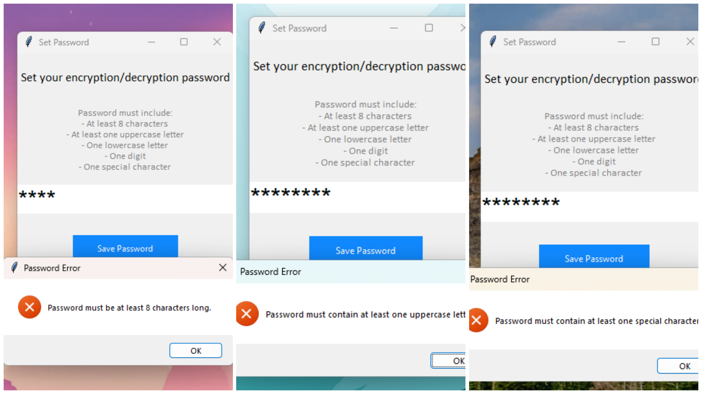

# Text & File Encrypter and Decrypter

The Text & File Encrypter and Decrypter is a Python-based GUI desktop application for securely encrypting and decrypting text and files using the AES encryption algorithm. This application supports AES-CBC and AES-GCM encryption modes, offering users a robust mechanism to protect sensitive data. It includes features to verify the integrity of decrypted messages, ensuring the correctness of encrypted data.

This application was developed as part of the Final Year Project for the <b>CSE-Cybersecurity Curriculum</b>, under the domain of <b>Cryptography and Data Security</b>. The application combines cryptographic principles with a user-friendly interface to address real-world data protection challenges.

The application has been bundled into a standalone executable <B>(main.exe)</B> located in dist folder, using PyInstaller, allowing easy execution without needing Python or dependencies pre-installed.

## Domain : CRYPTOGRAPHY AND DATA SECURITY
Cryptography and data security focus on the principles and techniques required to protect sensitive information from unauthorized access and tampering. It forms the backbone of cybersecurity, ensuring data confidentiality, integrity, and authenticity in transit and at rest. This domain encompasses encryption algorithms, hashing methods, digital signatures, and secure communication protocols.

The project aligns with this domain by providing:

1) <b>Confidentiality:</b> Ensures sensitive data is accessible only to authorized users through encryption.
2) <B>Integrity:</B> Verifies that data remains unchanged or uncorrupted.
3) <B>Usability:</B> Simplifies secure encryption and decryption for end-users through a graphical interface.
### Vision
This project's vision is to demonstrate the practical implementation of cryptographic techniques in securing digital information, addressing common security concerns like data breaches, unauthorized access, and file tampering. It aims to provide an extensible platform for further research and development in the field of cryptography.

## Features

### 1) Text Encryption and Decryption
- Encrypts and decrypts user-provided text using a secure password.
- Supports AES encryption with CBC and GCM modes.
- Provides a progress bar for visual feedback during processing.
### 2) File Encryption and Decryption
- Encrypts and decrypts files of any type.
- Encrypted files are saved with a .enc extension, while decrypted files are restored to their original format.
### 3) Password Protection
- Users set a secure password to access the application.
- Passwords are hashed and salted for secure storage.
- Validates password strength (minimum 8 characters, uppercase, lowercase, digit, and special character).
### 4) Integrity Verification
- Checks if the encrypted message or file is corrupted during decryption.
- Ensures that only valid encrypted data can be decrypted successfully.
### 5) Lockout Mechanism
- After 3 failed password attempts, the user is locked out for 30 seconds.
### 6) Encryption Modes
- AES-CBC (Cipher Block Chaining): Requires an initialization vector (IV) for encryption.
- AES-GCM (Galois/Counter Mode): Provides encryption and authentication, ensuring data integrity.
### 7) User-Friendly Interface
- Developed using Tkinter, offering a clean and intuitive graphical interface.
- Includes reset options and detailed error handling.
### 8) Standalone Execution
- Packaged as an executable file (main.exe) using PyInstaller.
- No need for Python installation or additional dependencies.

## Screenshots
     
   .png)   

## Prerequisites
- The standalone executable (<b>main.exe</b>) can be run on any Windows system without additional setup.
- For running the Python source code:
  - <b>Python 3.8+</b>
  - Required Python libraries:
    - tkinter
    - pycryptodome
    
  Install dependencies with :
  ```pip install pycryptodome```

## Usage Instructions
### Running the Application
1) Download the packaged executable (<b>main.exe</b>) along with the dependencies.
2) Double-click the <b>main.exe</b> file to launch the application.

## Setting Up the Password
1) Upon first launch, the application prompts you to set a secure password.
2) Follow the password requirements:
   - At least 8 characters long.
   - Contains at least one uppercase letter, one lowercase letter, one digit, and one special character.
3) Save your password for future use, as it is required for encryption and decryption.

## Text Encryption/Decryption
1) Enter the text you want to encrypt in the provided text box.
2) Set the password in the "Enter secret key" field.
3) Select the encryption mode (AES-CBC or AES-GCM).
4) Click <b>Encrypt Text</b> to encrypt or <b>Decrypt Text</b> to decrypt the message.
5) The result is displayed in a new window and can be saved as a file.

## File Encryption/Decryption
1) Click Encrypt File or Decrypt File.
2) Select the file you want to encrypt or decrypt using the file dialog.
3) For encryption:
    - Save the encrypted file as a ```.enc``` file.
4) For decryption:
    - Save the decrypted file to its original format.

## Encryption Modes
- <b>AES-CBC:</b>
    - Requires a random initialization vector (IV) for encryption.
    - Suitable for standard encryption tasks.
- <b>AES-GCM:</b>
    - Provides encryption and authentication.
    - Detects tampering during decryption.
## Error Handling
- <b>Password Validation:</b>
   - Prompts user to create a strong password during setup.
   - Displays detailed error messages for weak passwords.
- <b>Decryption Errors:</b>
  - Warns if the encrypted message is corrupted or an incorrect password is provided.
- <b>Lockout:</b>
  - Temporarily locks out users after multiple failed attempts.
## Lockout Mechanism
- 3 failed password attempts trigger a 30-second lockout.
- After the lockout period, users can retry logging in.

## Security Notes
- Passwords are never stored in plaintext; they are hashed with a salt using SHA-256.
- The application uses ```pycryptodome``` for cryptographic operations, ensuring strong security.
- AES-GCM mode provides additional integrity verification, preventing data tampering.

## Known Limitations
- The password is stored in memory for the session. Exiting the application requires resetting the password.
- The application does not persist encrypted text or file history across sessions.

## Technology Stack
- Programming Language: Python
- Libraries:
  - pycryptodome for cryptographic functions.
  - tkinter for the graphical interface.
## License
This project is open-source and available for modification under the <b>MIT License</b>. Contributions are encouraged to help make encryption more accessible and reliable for users worldwide.
